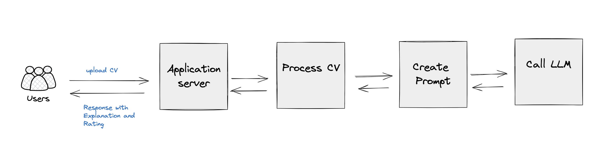

# Design Choices and Output Evaluation

## Design Choices

### 1. Modular Architecture

Chose a modular architecture to enhance maintainability, scalability, and testability. The project is divided into several key components:

- `main.py`: FastAPI application entry point
- `utilities.py`: Utility functions for CV processing and output formatting
- `openai_client.py`: OpenAI API communication
- `config.py`: Configuration management

This separation of concerns allows for easier updates and extensions to individual components without affecting the entire system.

### 2. FastAPI Framework (Given, also for the following reason)
- High performance
- Easy-to-use async support
- Automatic API documentation
- Type checking with Pydantic

These features allow for rapid development and maintainable code.

### 3. OpenAI GPT Model

Use OpenAI's GPT model for analyzing CVs because:
- It can understand and process natural language effectively
- It can be fine-tuned with specific prompts to perform specialized tasks
- It provides flexibility in handling various CV formats and content

### 4. Asynchronous Processing

Asynchronous processing is implemented to handle multiple requests efficiently, especially when dealing with potentially slow operations like file reading and API calls.

### 5. Error Handling and Logging

Comprehensive error handling and logging are implemented throughout the application to aid in debugging and improve the user experience.

### 6. Configuration Management

A separate `config.py` file is used to centralize configuration variables, making it easier to modify settings without changing the core code.

### 7. Docker Support (Optional)

Docker support is added to ensure consistent deployment across different environments and to simplify the setup process.

## Evaluating the Output

To evaluate the effectiveness of the O-1A Visa Eligibility Analyzer, consider the following aspects:

### 1. Accuracy

- Compare the AI's analysis with expert human evaluations on a set of sample CVs.
- Track the correlation between the AI's ratings and actual visa application outcomes (if such data becomes available).

### 2. Consistency

- Test the system with multiple variations of the same CV to ensure consistent results.
- Evaluate the system's performance across different fields (e.g., sciences, business, athletics).

### 3. Comprehensiveness

- Verify that the system addresses all eight O-1A criteria in its analysis.
- Check if the system captures both obvious and subtle indicators of extraordinary ability.

### 4. Clarity of Output

- Assess the readability and structure of the generated reports.
- Ensure that the explanations for each criterion are clear and relevant.

### 5. Performance

- Measure response times for various CV lengths and complexities.
- Test the system's ability to handle concurrent requests.

### 6. Robustness

- Test with various file formats (PDF, DOCX) and layouts to ensure consistent parsing.
- Evaluate the system's performance with edge cases (e.g., very short or very long CVs, CVs in different languages).

### 7. User Feedback

- Collect and analyze feedback from immigration lawyers or visa applicants who use the system.
- Use this feedback to identify areas for improvement and new features.

### 8. Ethical Considerations

- Regularly review the system's output for potential biases.
- Ensure that the system complies with data protection regulations and maintains user privacy.

By continuously evaluating these aspects and iterating on the design, we can improve the accuracy, reliability, and usefulness of the O-1A Visa Eligibility Analyzer.

Next Steps to explore:
- Use the "Relevant Examples and Considerations" to add more context to LLM
- Summarize these contents to keep the key information and reduce token size